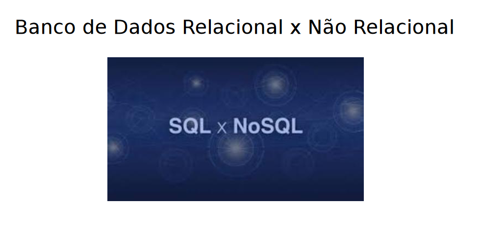

# Banco de Dados

<figure><figcaption></figcaption></figure>

<mark style="color:green;">Relacional -> SQL</mark>

<mark style="background-color:green;">-> Linguagem de Consulta Estruturada</mark>

* Linguagem padrão para se comunicar com bancos de dados relacionais

<mark style="color:green;">Não Relacional -> NoSQL</mark>

<mark style="background-color:green;">-> Não somente SQL</mark>

* Os Bancos de Dados podem ou não utilizar o SQL e geralmente utiliza comandos diferenciados

Learn MongoDB



Docs:



Terminal Online:



VsCode:


